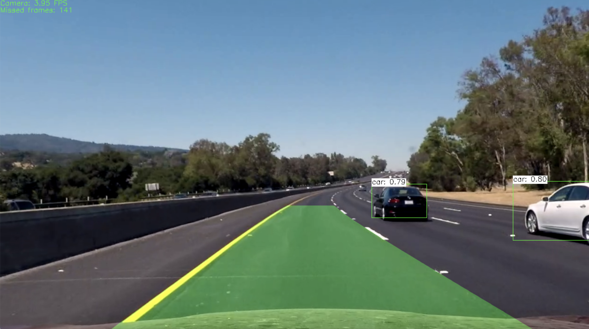

# Simple and advanced line and object detection application

This application will do a line and object detection on image or video.


## Prerequisites

`Unix`
`C++17`
`OpenCV 4.2.0`
`yaml-cpp 0.6.3`

## Build
```
mkdir build && cd build
cmake ../
make -j16
```

## Run
`./drivedetect -i <input_image_or_video> -c <detection_config>`

### Detection config

Detection configurations support simple line detection and advanced line detection.


*Simple line detection*

*Advanced line detection*

### Models

Models are based on OpenCV models. Model and classes used for development can be downloaded from this link: <https://drive.google.com/open?id=1_ZfaLfz48-zjQWfz4yYz46uUQEOjHgQX>